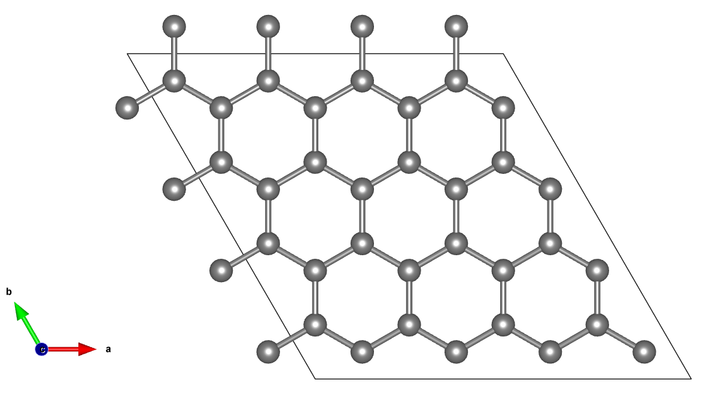
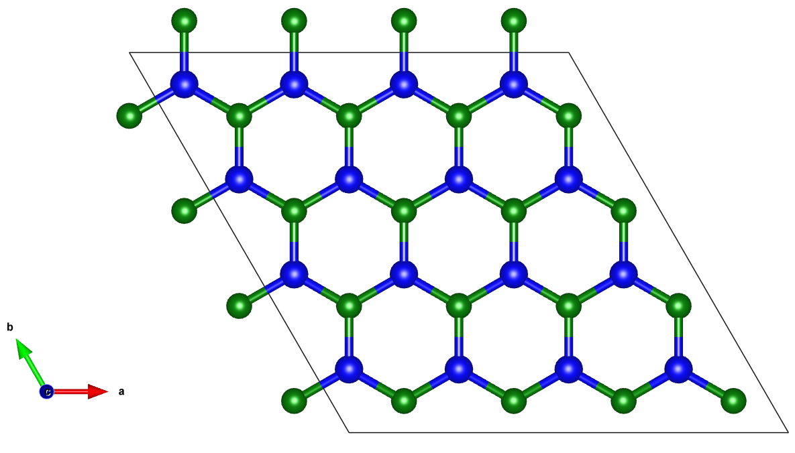

# 🧪 2D Material Generator

A simple graphical interface built with Python to generate **graphene** and **hBN (hexagonal boron nitride)** 2D crystal structures. It allows you to visualize and export the generated structures in both `.cif` and `.vasp` formats.

Requirements

    Python 3.x
    Libraries: tkinter, pymatgen, ase

2. Install the dependencies
bash
Copiar
Editar
pip install -r requirements.txt
3. Run the application
bash
Copiar
Editar
python material_generator.py

🧪 Dependencies
pymatgen

ase

tkinter (built-in with Python)

matplotlib (used for ASE visualization)

✅ Python 3.8+ is recommended.

📂 Output
{structure}.cif: Crystallographic Information File

{filename}.vasp: POSCAR file (VASP format)

Both are saved in the working directory after structure generation.

